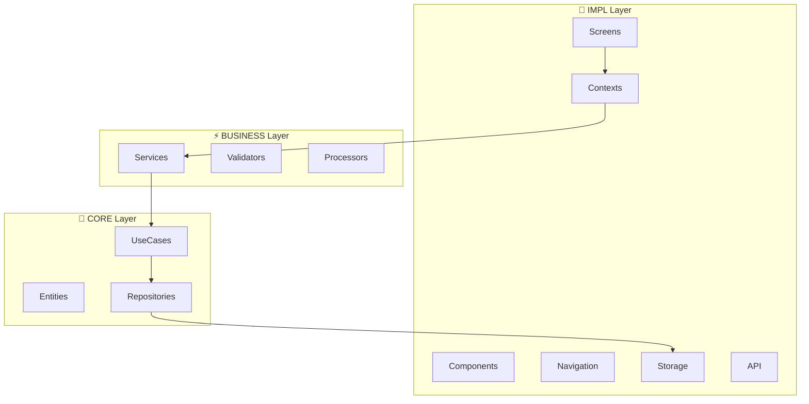

# 🍳 RecipeApp - App de Receitas React Native

[](https://reactnative.dev/)
[](https://www.typescriptlang.org/)
[](LICENSE)

> **Projeto didático para aprender React Native CLI com arquitetura robusta e escalável**

Um aplicativo de receitas desenvolvido seguindo princípios de **Clean Architecture**, **SOLID** e **design patterns** para demonstrar boas práticas em desenvolvimento React Native.

## 📋 Índice

- [🎯 Visão Geral](#-visão-geral)
- [🏗️ Arquitetura](#️-arquitetura)
- [📁 Estrutura de Pastas](#-estrutura-de-pastas)
- [🛠️ Tecnologias](#️-tecnologias)
- [⚡ Instalação](#-instalação)
- [📚 Metodologia](#-metodologia)
- [🔄 Fluxo de Dados](#-fluxo-de-dados)
- [📊 Diagramas](#-diagramas)
- [🎓 Conceitos Aplicados](#-conceitos-aplicados)
- [🤝 Contribuindo](#-contribuindo)
- [📄 Licença](#-licença)

## 🎯 Visão Geral

### **Funcionalidades**
- 📖 Listar receitas por categoria
- 🔍 Busca e filtros avançados
- ❤️ Sistema de favoritos
- 📱 Interface responsiva e moderna
- 💾 Persistência local de dados
- 🧭 Navegação intuitiva (Stack, Tab, Drawer)

### **Objetivos Didáticos**
- Aplicar **Clean Architecture** em React Native
- Implementar **SOLID principles**
- Gerenciamento de estado com **Context API**
- **Performance optimization**
- **Testing strategies**
- Boas práticas de desenvolvimento

## 🏗️ Arquitetura

### **Princípios Fundamentais**

#### **1. Separação de Responsabilidades**
- **CORE**: Regras de negócio puras, independentes de framework
- **BUSINESS**: Lógica específica da aplicação
- **IMPL**: Implementação com React Native

#### **2. Inversão de Dependência**
- Camadas superiores não dependem de implementações
- Uso de interfaces para desacoplar componentes
- Facilita testes e manutenção

#### **3. Padrão MVC por Camada**
- **Controller**: Lógica de controle e orquestração
- **View**: Componentes visuais e apresentação
- **Interface**: Contratos e tipos TypeScript

## 📁 Estrutura de Pastas

```
RecipeApp/
├── src/
│   ├── core/                    # 🎯 Camada Central - Regras de Negócio Puras
│   │   ├── entities/           # Modelos de dados principais
│   │   │   ├── controller/     # Lógica de manipulação de entidades
│   │   │   ├── view/          # Representação visual das entidades
│   │   │   └── interface/     # Contratos das entidades
│   │   ├── usecases/          # Casos de uso da aplicação
│   │   │   ├── controller/    # Orquestração dos casos de uso
│   │   │   ├── view/         # Apresentação dos casos de uso
│   │   │   └── interface/    # Contratos dos casos de uso
│   │   └── repositories/      # Interfaces dos repositórios
│   │       ├── controller/    # Controle de acesso aos dados
│   │       ├── view/         # Visualização dos dados
│   │       └── interface/    # Contratos de repositório
│   │
│   ├── business/              # ⚡ Camada de Negócio - Regras Específicas
│   │   ├── services/         # Serviços de negócio
│   │   │   ├── controller/   # Controle dos serviços
│   │   │   ├── view/        # Interface dos serviços
│   │   │   └── interface/   # Contratos dos serviços
│   │   ├── validators/       # Validações de negócio
│   │   │   ├── controller/   # Controle de validações
│   │   │   ├── view/        # Feedback de validações
│   │   │   └── interface/   # Contratos de validação
│   │   └── processors/       # Processadores de dados
│   │       ├── controller/   # Controle do processamento
│   │       ├── view/        # Visualização do processamento
│   │       └── interface/   # Contratos de processamento
│   │
│   ├── impl/                 # 📱 Camada de Implementação - Framework/UI
│   │   ├── screens/         # Telas da aplicação
│   │   │   ├── controller/  # Controle das telas
│   │   │   ├── view/       # Componentes visuais
│   │   │   └── interface/  # Props e tipos das telas
│   │   ├── components/      # Componentes reutilizáveis
│   │   │   ├── controller/  # Lógica dos componentes
│   │   │   ├── view/       # UI dos componentes
│   │   │   └── interface/  # Props dos componentes
│   │   ├── navigation/      # Configuração de navegação
│   │   │   ├── controller/  # Lógica de navegação
│   │   │   ├── view/       # Stack/Tab navigators
│   │   │   └── interface/  # Tipos de navegação
│   │   ├── contexts/        # Context providers
│   │   │   ├── controller/  # Lógica dos contexts
│   │   │   ├── view/       # Providers
│   │   │   └── interface/  # Tipos dos contexts
│   │   ├── hooks/          # Custom hooks
│   │   │   ├── controller/  # Lógica dos hooks
│   │   │   ├── view/       # Interface dos hooks
│   │   │   └── interface/  # Tipos dos hooks
│   │   ├── storage/        # Implementação de armazenamento
│   │   │   ├── controller/  # Controle do storage
│   │   │   ├── view/       # Interface de storage
│   │   │   └── interface/  # Contratos de storage
│   │   └── api/            # Implementação de APIs
│   │       ├── controller/  # Controle das APIs
│   │       ├── view/       # Formatação de dados
│   │       └── interface/  # Contratos de API
│   │
│   ├── shared/              # 🔗 Recursos Compartilhados
│   │   ├── constants/       # Constantes da aplicação
│   │   ├── utils/          # Funções utilitárias
│   │   ├── types/          # Tipos TypeScript globais
│   │   └── assets/         # Recursos estáticos
│   │
│   └── config/             # ⚙️ Configurações
│       ├── environment.ts   # Variáveis de ambiente
│       ├── theme.ts        # Tema da aplicação
│       └── navigation.ts   # Configurações de navegação
│
├── assets/                 # 🖼️ Recursos estáticos
│   ├── images/
│   ├── icons/
│   └── fonts/
│
└── __tests__/             # 🧪 Testes
    ├── core/
    ├── business/
    └── impl/
```

## 🛠️ Tecnologias

### **Framework Base**
- **React Native CLI** - Framework principal
- **TypeScript** - Tipagem estática
- **React Hooks** - Gerenciamento de estado

### **Navegação**
- `@react-navigation/native` - Navegação principal
- `@react-navigation/stack` - Stack navigation
- `@react-navigation/bottom-tabs` - Tab navigation
- `@react-navigation/drawer` - Drawer navigation

### **Estado e Dados**
- `@reduxjs/toolkit` - Gerenciamento de estado
- `react-redux` - Integração Redux com React
- `@react-native-async-storage/async-storage` - Persistência local

### **UI e Animações**
- `react-native-vector-icons` - Ícones
- `react-native-reanimated` - Animações
- `react-native-fast-image` - Otimização de imagens
- `react-native-linear-gradient` - Gradientes

### **Utilitários**
- `lodash` - Funções utilitárias
- `date-fns` - Manipulação de datas
- `react-native-uuid` - Geração de IDs

### **Testes**
- `@testing-library/react-native` - Testing utilities
- `jest` - Framework de testes

## ⚡ Instalação

### **Pré-requisitos**
- Node.js (≥ 16.x)
- React Native CLI
- Android Studio / Xcode
- JDK 11+

### **1. Clone o repositório**
```bash
git clone https://github.com/seu-usuario/recipe-app.git
cd recipe-app
```

### **2. Instale as dependências**
```bash
npm install
# ou
yarn install
```

### **3. Configure o ambiente**
```bash
# iOS
cd ios && pod install && cd ..

# Android
npx react-native run-android

# iOS
npx react-native run-ios
```

### **4. Inicie o Metro bundler**
```bash
npx react-native start
```

## 📚 Metodologia

### **🎯 Fase 1: Setup e Core (Semana 1-2)**
- [x] Setup do projeto React Native CLI
- [x] Configuração do TypeScript
- [ ] Core Layer - Entidades
- [ ] Core Layer - Repositórios

### **🎯 Fase 2: Business Logic (Semana 2-3)**
- [ ] Business Layer - Services
- [ ] Business Layer - Validators
- [ ] Core Layer - Use Cases

### **🎯 Fase 3: Implementation Layer (Semana 3-4)**
- [ ] Storage Implementation
- [ ] Context Setup
- [ ] Custom Hooks

### **🎯 Fase 4: UI Components (Semana 4-5)**
- [ ] Base Components
- [ ] Recipe Components
- [ ] Component Controllers

### **🎯 Fase 5: Screens (Semana 5-6)**
- [ ] Screen Views
- [ ] Screen Controllers
- [ ] Navigation Setup

### **🎯 Fase 6: Features Avançadas (Semana 6-7)**
- [ ] Search & Filter
- [ ] Sistema de Favoritos
- [ ] Performance Optimization

## 🔄 Fluxo de Dados

```
User Interaction
       ↓
impl/screens/view
       ↓
impl/screens/controller
       ↓
business/services/controller
       ↓
core/usecases/controller
       ↓
core/repositories/interface
       ↓
impl/storage/controller
       ↓
Data Source (AsyncStorage/API)
```

## 📊 Diagramas

### **Arquitetura Geral**

### **Fluxo de Dados**
```mermaid
sequenceDiagram
    participant User as 👤 User
    participant UI as 🎨 FavoriteButton.tsx
    participant Hook as 🪝 useFavorites
    participant Context as 📦 FavoriteContext
    participant Service as ⚡ FavoriteService
    participant Validator as ✅ FavoriteValidator
    participant UseCase as 🎯 ToggleFavoriteUseCase
    participant Repo as 💾 FavoriteRepository
    participant Storage as 📱 AsyncStorage

    User->>UI: Toca no botão favorito
    UI->>Hook: useFavorites().toggleFavorite(recipeId)
    Hook->>Context: toggleFavorite(recipeId)
    
    Context->>Service: favoriteService.toggleFavorite(recipeId)
    Service->>Validator: validateRecipeId(recipeId)
    Validator-->>Service: ValidationResult
    
    alt Validation Success
        Service->>UseCase: execute(recipeId)
        UseCase->>Repo: isFavorite(recipeId)
        Repo->>Storage: AsyncStorage.getItem()
        Storage-->>Repo: favorites[]
        Repo-->>UseCase: boolean
        
        alt Is Favorite
            UseCase->>Repo: removeFavorite(recipeId)
            Repo->>Storage: AsyncStorage.setItem()
        else Not Favorite
            UseCase->>Repo: addFavorite(recipeId)
            Repo->>Storage: AsyncStorage.setItem()
        end
        
        UseCase-->>Service: boolean (new state)
        Service-->>Context: FavoriteUseCaseResult
        Context->>Context: setFavorites(newState)
        Context-->>Hook: Updated context
        Hook-->>UI: Re-render with new state
        UI-->>User: Visual feedback (heart filled/empty)
    else Validation Error
        Service-->>Context: Error
        Context-->>UI: Error state
        UI-->>User: Error feedback
    end
    ```

### **Entidades Principais**

#### **Recipe (Receita)**
```typescript
interface Recipe {
  id: string;
  title: string;
  description: string;
  ingredients: Ingredient[];
  instructions: Step[];
  category: Category;
  difficulty: Difficulty;
  prepTime: number;
  servings: number;
  image: string;
  isFavorite: boolean;
  rating: number;
  createdAt: Date;
}
```

#### **Category (Categoria)**
```typescript
interface Category {
  id: string;
  name: string;
  description: string;
  icon: string;
  color: string;
}
```

#### **Filter (Filtro)**
```typescript
interface RecipeFilter {
  categories: string[];
  difficulty: Difficulty[];
  maxPrepTime: number;
  minRating: number;
  searchQuery: string;
}
```

## 🎓 Conceitos Aplicados

### **1. Clean Architecture**
- Separação clara de responsabilidades
- Independência de frameworks
- Facilidade para testes

### **2. SOLID Principles**
- **S**ingle Responsibility: Cada classe tem uma responsabilidade
- **O**pen/Closed: Aberto para extensão, fechado para modificação
- **L**iskov Substitution: Substituição de implementações
- **I**nterface Segregation: Interfaces específicas
- **D**ependency Inversion: Dependência de abstrações

### **3. Design Patterns**
- **Repository Pattern**: Abstração da camada de dados
- **Use Case Pattern**: Encapsula regras de negócio
- **MVC por Camada**: Model-View-Controller

### **4. React Native Best Practices**
- **Performance**: FlatList otimizado, React.memo, useMemo
- **Navigation**: Stack, Tab e Drawer navigation
- **State Management**: Context API e Custom Hooks
- **Storage**: AsyncStorage para persistência

## 🎯 Aspectos Didáticos

### **Por que esta arquitetura?**
1. **Escalabilidade**: Fácil de adicionar novas features
2. **Manutenibilidade**: Código organizado e testável
3. **Reutilização**: Componentes e lógica reutilizáveis
4. **Aprendizado**: Aplica boas práticas da indústria

### **O que você aprenderá:**
- Arquitetura de software robusta
- Padrões de design aplicados
- TypeScript avançado
- React Native best practices
- Gerenciamento de estado complexo
- Performance optimization
- Testing strategies

## 🤝 Contribuindo

1. Fork o projeto
2. Crie uma branch para sua feature (`git checkout -b feature/AmazingFeature`)
3. Commit suas mudanças (`git commit -m 'Add some AmazingFeature'`)
4. Push para a branch (`git push origin feature/AmazingFeature`)
5. Abra um Pull Request

### **Diretrizes de Contribuição**
- Siga a arquitetura estabelecida
- Mantenha a separação de responsabilidades
- Adicione testes para novas funcionalidades
- Documente mudanças significativas

## 🚀 Roadmap

- [ ] **v1.0** - Funcionalidades básicas
- [ ] **v1.1** - Sistema de avaliações
- [ ] **v1.2** - Modo offline
- [ ] **v2.0** - Sincronização em nuvem
- [ ] **v2.1** - Compartilhamento de receitas
- [ ] **v3.0** - IA para recomendações

## 📄 Licença

Este projeto está sob a licença MIT. Veja o arquivo [LICENSE](LICENSE) para mais detalhes.

---

**Desenvolvido para fins didáticos e aprendizado de React Native**

---

⭐ **Se este projeto te ajudou, não esqueça de dar uma estrela!**
