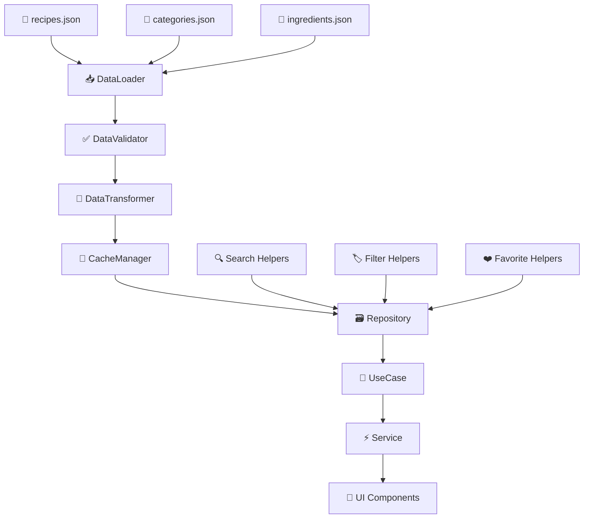
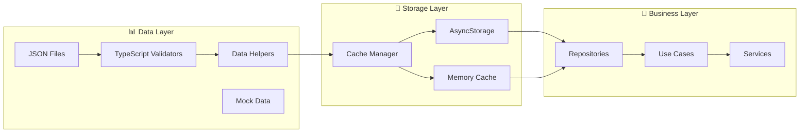

<<<<<<< HEAD
This is a new [**React Native**](https://reactnative.dev) project, bootstrapped using [`@react-native-community/cli`](https://github.com/react-native-community/cli).

# Getting Started

> **Note**: Make sure you have completed the [Set Up Your Environment](https://reactnative.dev/docs/set-up-your-environment) guide before proceeding.

## Step 1: Start Metro

First, you will need to run **Metro**, the JavaScript build tool for React Native.

To start the Metro dev server, run the following command from the root of your React Native project:

```sh
# Using npm
npm start

# OR using Yarn
yarn start
```

## Step 2: Build and run your app

With Metro running, open a new terminal window/pane from the root of your React Native project, and use one of the following commands to build and run your Android or iOS app:

### Android

```sh
# Using npm
npm run android

# OR using Yarn
yarn android
```

### iOS

For iOS, remember to install CocoaPods dependencies (this only needs to be run on first clone or after updating native deps).

The first time you create a new project, run the Ruby bundler to install CocoaPods itself:

```sh
bundle install
```

Then, and every time you update your native dependencies, run:

```sh
bundle exec pod install
```

For more information, please visit [CocoaPods Getting Started guide](https://guides.cocoapods.org/using/getting-started.html).

```sh
# Using npm
npm run ios

# OR using Yarn
yarn ios
```

If everything is set up correctly, you should see your new app running in the Android Emulator, iOS Simulator, or your connected device.

This is one way to run your app — you can also build it directly from Android Studio or Xcode.

## Step 3: Modify your app

Now that you have successfully run the app, let's make changes!

Open `App.tsx` in your text editor of choice and make some changes. When you save, your app will automatically update and reflect these changes — this is powered by [Fast Refresh](https://reactnative.dev/docs/fast-refresh).

When you want to forcefully reload, for example to reset the state of your app, you can perform a full reload:

- **Android**: Press the <kbd>R</kbd> key twice or select **"Reload"** from the **Dev Menu**, accessed via <kbd>Ctrl</kbd> + <kbd>M</kbd> (Windows/Linux) or <kbd>Cmd ⌘</kbd> + <kbd>M</kbd> (macOS).
- **iOS**: Press <kbd>R</kbd> in iOS Simulator.

## Congratulations! :tada:

You've successfully run and modified your React Native App. :partying_face:

### Now what?

- If you want to add this new React Native code to an existing application, check out the [Integration guide](https://reactnative.dev/docs/integration-with-existing-apps).
- If you're curious to learn more about React Native, check out the [docs](https://reactnative.dev/docs/getting-started).

# Troubleshooting

If you're having issues getting the above steps to work, see the [Troubleshooting](https://reactnative.dev/docs/troubleshooting) page.

# Learn More

To learn more about React Native, take a look at the following resources:

- [React Native Website](https://reactnative.dev) - learn more about React Native.
- [Getting Started](https://reactnative.dev/docs/environment-setup) - an **overview** of React Native and how setup your environment.
- [Learn the Basics](https://reactnative.dev/docs/getting-started) - a **guided tour** of the React Native **basics**.
- [Blog](https://reactnative.dev/blog) - read the latest official React Native **Blog** posts.
- [`@facebook/react-native`](https://github.com/facebook/react-native) - the Open Source; GitHub **repository** for React Native.
=======
# 🍳 RecipeApp - App de Receitas React Native

[](https://reactnative.dev/)
[](https://www.typescriptlang.org/)
[](LICENSE)

> **Projeto didático para aprender React Native CLI com arquitetura robusta e escalável**

Um aplicativo de receitas desenvolvido seguindo princípios de **Clean Architecture**, **SOLID** e **design patterns** para demonstrar boas práticas em desenvolvimento React Native.

## 📋 Índice

- [🎯 Visão Geral](#-visão-geral)
- [🏗️ Arquitetura](#️-arquitetura)
- [📁 Estrutura Completa](#-estrutura-completa)
- [🛠️ Tecnologias](#️-tecnologias)
- [📊 Estratégia de Dados](#-estratégia-de-dados)
- [⚡ Instalação](#-instalação)
- [📚 Metodologia](#-metodologia)
- [🔄 Fluxo de Dados](#-fluxo-de-dados)
- [📈 Diagramas](#-diagramas)
- [🎓 Conceitos Aplicados](#-conceitos-aplicados)
- [🤝 Contribuindo](#-contribuindo)
- [📄 Licença](#-licença)

## 🎯 Visão Geral

### **Funcionalidades**
- 📖 Listar receitas por categoria
- 🔍 Busca e filtros avançados
- ❤️ Sistema de favoritos
- 📱 Interface responsiva e moderna
- 💾 Persistência local de dados
- 🧭 Navegação intuitiva (Stack, Tab, Drawer)

### **Objetivos Didáticos**
- Aplicar **Clean Architecture** em React Native
- Implementar **SOLID principles**
- Gerenciamento de estado com **Context API**
- **Performance optimization**
- **Testing strategies**
- Boas práticas de desenvolvimento

## 🏗️ Arquitetura

### **Princípios Fundamentais**

#### **1. Separação de Responsabilidades**
- **CORE**: Regras de negócio puras, independentes de framework
- **BUSINESS**: Lógica específica da aplicação
- **IMPL**: Implementação com React Native

#### **2. Inversão de Dependência**
- Camadas superiores não dependem de implementações
- Uso de interfaces para desacoplar componentes
- Facilita testes e manutenção

#### **3. Padrão MVC por Camada**
- **Controller**: Lógica de controle e orquestração
- **View**: Componentes visuais e apresentação
- **Interface**: Contratos e tipos TypeScript

## 📁 Estrutura Completa

```
RecipeApp/
├── 📱 src/
│   ├── 🎯 core/                           # Camada Central - Regras de Negócio Puras
│   │   ├── entities/                      # Modelos de dados principais
│   │   │   ├── controller/               # Lógica de manipulação de entidades
│   │   │   │   ├── RecipeController.ts
│   │   │   │   ├── CategoryController.ts
│   │   │   │   └── FilterController.ts
│   │   │   ├── view/                     # Representação visual das entidades
│   │   │   │   ├── RecipeFormatter.ts
│   │   │   │   ├── CategoryFormatter.ts
│   │   │   │   └── NutritionalFormatter.ts
│   │   │   └── interface/                # Contratos das entidades
│   │   │       ├── Recipe.ts
│   │   │       ├── Category.ts
│   │   │       ├── Ingredient.ts
│   │   │       ├── Instruction.ts
│   │   │       └── Filter.ts
│   │   ├── usecases/                     # Casos de uso da aplicação
│   │   │   ├── controller/               # Orquestração dos casos de uso
│   │   │   │   ├── GetRecipesUseCase.ts
│   │   │   │   ├── SearchRecipesUseCase.ts
│   │   │   │   ├── FilterRecipesUseCase.ts
│   │   │   │   ├── ToggleFavoriteUseCase.ts
│   │   │   │   └── GetCategoriesUseCase.ts
│   │   │   ├── view/                     # Apresentação dos casos de uso
│   │   │   │   ├── RecipeListView.ts
│   │   │   │   ├── SearchResultView.ts
│   │   │   │   └── FavoriteResultView.ts
│   │   │   └── interface/                # Contratos dos casos de uso
│   │   │       ├── IGetRecipesUseCase.ts
│   │   │       ├── ISearchUseCase.ts
│   │   │       └── IFavoriteUseCase.ts
│   │   └── repositories/                 # Interfaces dos repositórios
│   │       ├── controller/               # Controle de acesso aos dados
│   │       │   ├── RepositoryManager.ts
│   │       │   └── CacheController.ts
│   │       ├── view/                     # Visualização dos dados
│   │       │   ├── DataPresenter.ts
│   │       │   └── ErrorPresenter.ts
│   │       └── interface/                # Contratos de repositório
│   │           ├── IRecipeRepository.ts
│   │           ├── ICategoryRepository.ts
│   │           └── IFavoriteRepository.ts
│   │
│   ├── ⚡ business/                       # Camada de Negócio - Regras Específicas
│   │   ├── services/                     # Serviços de negócio
│   │   │   ├── controller/               # Controle dos serviços
│   │   │   │   ├── RecipeService.ts
│   │   │   │   ├── SearchService.ts
│   │   │   │   ├── FilterService.ts
│   │   │   │   ├── FavoriteService.ts
│   │   │   │   └── RecommendationService.ts
│   │   │   ├── view/                     # Interface dos serviços
│   │   │   │   ├── ServiceResultView.ts
│   │   │   │   └── ServiceErrorView.ts
│   │   │   └── interface/                # Contratos dos serviços
│   │   │       ├── IRecipeService.ts
│   │   │       ├── ISearchService.ts
│   │   │       └── IFavoriteService.ts
│   │   ├── validators/                   # Validações de negócio
│   │   │   ├── controller/               # Controle de validações
│   │   │   │   ├── RecipeValidator.ts
│   │   │   │   ├── SearchValidator.ts
│   │   │   │   └── FilterValidator.ts
│   │   │   ├── view/                     # Feedback de validações
│   │   │   │   ├── ValidationErrorView.ts
│   │   │   │   └── ValidationSuccessView.ts
│   │   │   └── interface/                # Contratos de validação
│   │   │       ├── IValidator.ts
│   │   │       └── ValidationResult.ts
│   │   └── processors/                   # Processadores de dados
│   │       ├── controller/               # Controle do processamento
│   │       │   ├── DataProcessor.ts
│   │       │   ├── ImageProcessor.ts
│   │       │   └── SearchProcessor.ts
│   │       ├── view/                     # Visualização do processamento
│   │       │   ├── ProcessingStatusView.ts
│   │       │   └── ProcessingResultView.ts
│   │       └── interface/                # Contratos de processamento
│   │           ├── IDataProcessor.ts
│   │           └── ProcessingOptions.ts
│   │
│   ├── 📱 impl/                          # Camada de Implementação - Framework/UI
│   │   ├── screens/                      # Telas da aplicação
│   │   │   ├── controller/               # Controle das telas
│   │   │   │   ├── HomeScreenController.ts
│   │   │   │   ├── RecipeDetailController.ts
│   │   │   │   ├── SearchController.ts
│   │   │   │   ├── CategoriesController.ts
│   │   │   │   └── FavoritesController.ts
│   │   │   ├── view/                     # Componentes visuais
│   │   │   │   ├── HomeScreen.tsx
│   │   │   │   ├── RecipeDetailScreen.tsx
│   │   │   │   ├── SearchScreen.tsx
│   │   │   │   ├── CategoriesScreen.tsx
│   │   │   │   └── FavoritesScreen.tsx
│   │   │   └── interface/                # Props e tipos das telas
│   │   │       ├── HomeScreenTypes.ts
│   │   │       ├── RecipeDetailTypes.ts
│   │   │       ├── SearchTypes.ts
│   │   │       └── NavigationTypes.ts
│   │   ├── components/                   # Componentes reutilizáveis
│   │   │   ├── controller/               # Lógica dos componentes
│   │   │   │   ├── RecipeCardController.ts
│   │   │   │   ├── CategoryCardController.ts
│   │   │   │   ├── FilterModalController.ts
│   │   │   │   └── SearchBarController.ts
│   │   │   ├── view/                     # UI dos componentes
│   │   │   │   ├── common/               # Componentes base
│   │   │   │   │   ├── Button.tsx
│   │   │   │   │   ├── Input.tsx
│   │   │   │   │   ├── Card.tsx
│   │   │   │   │   ├── Loading.tsx
│   │   │   │   │   └── Modal.tsx
│   │   │   │   ├── recipe/               # Componentes de receita
│   │   │   │   │   ├── RecipeCard.tsx
│   │   │   │   │   ├── RecipeList.tsx
│   │   │   │   │   ├── RecipeDetail.tsx
│   │   │   │   │   ├── IngredientList.tsx
│   │   │   │   │   └── InstructionList.tsx
│   │   │   │   ├── category/             # Componentes de categoria
│   │   │   │   │   ├── CategoryCard.tsx
│   │   │   │   │   ├── CategoryList.tsx
│   │   │   │   │   └── CategoryFilter.tsx
│   │   │   │   └── search/               # Componentes de busca
│   │   │   │       ├── SearchBar.tsx
│   │   │   │       ├── FilterModal.tsx
│   │   │   │       ├── SearchResults.tsx
│   │   │   │       └── FilterChips.tsx
│   │   │   └── interface/                # Props dos componentes
│   │   │       ├── CommonComponentTypes.ts
│   │   │       ├── RecipeComponentTypes.ts
│   │   │       ├── CategoryComponentTypes.ts
│   │   │       └── SearchComponentTypes.ts
│   │   ├── navigation/                   # Configuração de navegação
│   │   │   ├── controller/               # Lógica de navegação
│   │   │   │   ├── NavigationController.ts
│   │   │   │   ├── TabController.ts
│   │   │   │   └── StackController.ts
│   │   │   ├── view/                     # Stack/Tab navigators
│   │   │   │   ├── AppNavigator.tsx
│   │   │   │   ├── TabNavigator.tsx
│   │   │   │   ├── StackNavigator.tsx
│   │   │   │   └── DrawerNavigator.tsx
│   │   │   └── interface/                # Tipos de navegação
│   │   │       ├── NavigationTypes.ts
│   │   │       ├── RouteParams.ts
│   │   │       └── NavigationProps.ts
│   │   ├── contexts/                     # Context providers
│   │   │   ├── controller/               # Lógica dos contexts
│   │   │   │   ├── RecipeContextController.ts
│   │   │   │   ├── FilterContextController.ts
│   │   │   │   ├── FavoriteContextController.ts
│   │   │   │   └── ThemeContextController.ts
│   │   │   ├── view/                     # Providers
│   │   │   │   ├── RecipeProvider.tsx
│   │   │   │   ├── FilterProvider.tsx
│   │   │   │   ├── FavoriteProvider.tsx
│   │   │   │   └── ThemeProvider.tsx
│   │   │   └── interface/                # Tipos dos contexts
│   │   │       ├── RecipeContextTypes.ts
│   │   │       ├── FilterContextTypes.ts
│   │   │       ├── FavoriteContextTypes.ts
│   │   │       └── ThemeContextTypes.ts
│   │   ├── hooks/                        # Custom hooks
│   │   │   ├── controller/               # Lógica dos hooks
│   │   │   │   ├── useRecipesController.ts
│   │   │   │   ├── useSearchController.ts
│   │   │   │   ├── useFavoritesController.ts
│   │   │   │   └── useFiltersController.ts
│   │   │   ├── view/                     # Interface dos hooks
│   │   │   │   ├── useRecipes.ts
│   │   │   │   ├── useSearch.ts
│   │   │   │   ├── useFavorites.ts
│   │   │   │   ├── useFilters.ts
│   │   │   │   └── useNavigation.ts
│   │   │   └── interface/                # Tipos dos hooks
│   │   │       ├── RecipeHookTypes.ts
│   │   │       ├── SearchHookTypes.ts
│   │   │       └── FavoriteHookTypes.ts
│   │   ├── storage/                      # Implementação de armazenamento
│   │   │   ├── controller/               # Controle do storage
│   │   │   │   ├── AsyncStorageRepository.ts
│   │   │   │   ├── CacheManager.ts
│   │   │   │   ├── DataManager.ts
│   │   │   │   └── FavoriteStorageManager.ts
│   │   │   ├── view/                     # Interface de storage
│   │   │   │   ├── StorageStatusView.ts
│   │   │   │   └── DataSyncView.ts
│   │   │   └── interface/                # Contratos de storage
│   │   │       ├── IAsyncStorage.ts
│   │   │       ├── ICacheManager.ts
│   │   │       └── StorageTypes.ts
│   │   └── api/                          # Implementação de APIs (futuro)
│   │       ├── controller/               # Controle das APIs
│   │       │   ├── RecipeApiController.ts
│   │       │   └── CategoryApiController.ts
│   │       ├── view/                     # Formatação de dados
│   │       │   ├── ApiResponseFormatter.ts
│   │       │   └── ApiErrorFormatter.ts
│   │       └── interface/                # Contratos de API
│   │           ├── IRecipeApi.ts
│   │           ├── ApiTypes.ts
│   │           └── ApiResponses.ts
│   │
│   ├── 🔗 shared/                        # Recursos Compartilhados
│   │   ├── data/                         # 📊 ESTRATÉGIA HÍBRIDA: JSON + TypeScript
│   │   │   ├── json/                     # 📄 Dados puros em JSON
│   │   │   │   ├── recipes.json          # Lista completa de receitas
│   │   │   │   ├── categories.json       # Categorias disponíveis
│   │   │   │   ├── ingredients.json      # Base de ingredientes
│   │   │   │   └── nutritional.json      # Dados nutricionais
│   │   │   ├── typescript/               # 🏷️ Validação e helpers TS
│   │   │   │   ├── DataValidator.ts      # Validação dos dados JSON
│   │   │   │   ├── DataLoader.ts         # Carregador de dados
│   │   │   │   ├── DataSeeder.ts         # Gerador de dados extras
│   │   │   │   └── DataTransformer.ts    # Transformações dos dados
│   │   │   ├── helpers/                  # 🔧 Funções auxiliares
│   │   │   │   ├── recipeHelpers.ts      # Helpers para receitas
│   │   │   │   ├── categoryHelpers.ts    # Helpers para categorias
│   │   │   │   ├── searchHelpers.ts      # Helpers para busca
│   │   │   │   └── filterHelpers.ts      # Helpers para filtros
│   │   │   └── mock/                     # 🎭 Dados mockados para testes
│   │   │       ├── mockRecipes.ts        # Receitas de teste
│   │   │       ├── mockCategories.ts     # Categorias de teste
│   │   │       └── mockUsers.ts          # Usuários de teste
│   │   ├── constants/                    # Constantes da aplicação
│   │   │   ├── appConstants.ts           # Constantes gerais
│   │   │   ├── navigationConstants.ts    # Constantes de navegação
│   │   │   ├── storageKeys.ts           # Chaves do AsyncStorage
│   │   │   └── defaultValues.ts         # Valores padrão
│   │   ├── utils/                        # Funções utilitárias
│   │   │   ├── dateUtils.ts             # Utilitários de data
│   │   │   ├── stringUtils.ts           # Utilitários de string
│   │   │   ├── numberUtils.ts           # Utilitários numéricos
│   │   │   ├── imageUtils.ts            # Utilitários de imagem
│   │   │   └── validationUtils.ts       # Utilitários de validação
│   │   ├── types/                        # Tipos TypeScript globais
│   │   │   ├── recipe.types.ts          # Tipos de receitas
│   │   │   ├── category.types.ts        # Tipos de categorias
│   │   │   ├── navigation.types.ts      # Tipos de navegação
│   │   │   ├── api.types.ts             # Tipos de API
│   │   │   └── common.types.ts          # Tipos comuns
│   │   └── assets/                       # Recursos estáticos
│   │       ├── images/                   # Imagens locais
│   │       │   ├── placeholder.png
│   │       │   ├── logo.png
│   │       │   └── categories/
│   │       ├── icons/                    # Ícones customizados
│   │       │   ├── recipe-icon.svg
│   │       │   └── category-icons/
│   │       └── fonts/                    # Fontes customizadas
│   │           └── custom-font.ttf
│   │
│   └── ⚙️ config/                        # Configurações
│       ├── environment.ts                # Variáveis de ambiente
│       ├── theme.ts                      # Tema da aplicação
│       ├── navigation.ts                 # Configurações de navegação
│       └── storage.ts                    # Configurações de storage
│
├── 🖼️ assets/                           # Recursos estáticos externos
│   ├── images/
│   │   ├── recipes/                      # Imagens de receitas
│   │   │   ├── carbonara.jpg
│   │   │   ├── caesar-salad.jpg
│   │   │   └── brownie.jpg
│   │   ├── categories/                   # Imagens de categorias
│   │   │   ├── main-dishes.jpg
│   │   │   ├── desserts.jpg
│   │   │   └── healthy.jpg
│   │   └── splash/                       # Telas de carregamento
│   │       ├── splash-screen.png
│   │       └── app-icon.png
│   ├── icons/
│   │   ├── tab-icons/                    # Ícones da barra de tabs
│   │   ├── category-icons/               # Ícones de categorias
│   │   └── ui-icons/                     # Ícones da interface
│   └── fonts/                            # Fontes adicionais
│       ├── Roboto-Regular.ttf
│       └── Roboto-Bold.ttf
│
└── 🧪 __tests__/                        # Testes
    ├── core/                             # Testes da camada core
    │   ├── entities/
    │   ├── usecases/
    │   └── repositories/
    ├── business/                         # Testes da camada business
    │   ├── services/
    │   ├── validators/
    │   └── processors/
    ├── impl/                             # Testes da implementação
    │   ├── screens/
    │   ├── components/
    │   └── hooks/
    ├── shared/                           # Testes dos recursos compartilhados
    │   ├── data/
    │   └── utils/
    └── __mocks__/                        # Mocks para testes
        ├── mockData.ts
        ├── mockNavigation.ts
        └── mockAsyncStorage.ts
```

## 📊 Estratégia de Dados

### **🎯 Abordagem Híbrida: JSON + TypeScript**

#### **Por que esta estratégia?**

##### **1. JSON para Dados Puros** 📄
- **Facilidade de edição**: Qualquer pessoa pode editar sem conhecer TypeScript
- **Flexibilidade**: Fácil adicionar novas receitas sem recompilação
- **Legibilidade**: Estrutura clara e simples
- **Portabilidade**: Pode ser usado em qualquer plataforma

##### **2. TypeScript para Validação** 🏷️
- **Type Safety**: Garante que os dados estão corretos
- **Validação**: Verifica integridade dos dados JSON
- **Helpers**: Funções para manipular e filtrar dados
- **Performance**: Cache e otimizações

### **🔄 Como Funciona**

```
recipes.json → DataLoader.ts → DataValidator.ts → DataTransformer.ts → App
     ↓              ↓                ↓                    ↓           ↓
  Dados puros   Carrega JSON    Valida tipos    Transforma     Usa na app
```

### **📁 Estrutura de Dados**

#### **1. JSON Files (`src/shared/data/json/`)**
```json
// recipes.json - Exemplo
{
  "recipes": [
    {
      "id": "rec-001",
      "title": "Spaghetti à Carbonara",
      "description": "Clássico prato italiano",
      "categoryId": "cat-003",
      "difficulty": "medium",
      "prepTime": 15,
      "cookTime": 20,
      "servings": 4,
      "ingredients": [
        {
          "id": "ing-001",
          "name": "Spaghetti",
          "quantity": 400,
          "unit": "g"
        }
      ],
      "instructions": [
        {
          "step": 1,
          "description": "Cozinhe o spaghetti...",
          "duration": 10
        }
      ],
      "nutritional": {
        "calories": 520,
        "protein": 25,
        "carbs": 60,
        "fat": 18
      },
      "tags": ["italiano", "clássico", "massa"],
      "rating": 4.7,
      "reviewCount": 1250,
      "image": "carbonara.jpg",
      "createdAt": "2024-01-15T10:30:00Z",
      "author": "Chef Mario"
    }
  ]
}
```

#### **2. TypeScript Validators (`src/shared/data/typescript/`)**
```typescript
// DataValidator.ts - Exemplo da lógica
export class DataValidator {
  static validateRecipes(jsonData: any): Recipe[] {
    // Valida e transforma JSON em tipos TypeScript
    // Garante integridade dos dados
    // Aplica validações de negócio
  }
  
  static validateCategories(jsonData: any): Category[] {
    // Valida categorias
  }
}
```

#### **3. Data Helpers (`src/shared/data/helpers/`)**
```typescript
// recipeHelpers.ts - Exemplo
export const RecipeHelpers = {
  getRecipesByCategory: (recipes: Recipe[], categoryId: string) => Recipe[],
  getRecipesByDifficulty: (recipes: Recipe[], difficulty: Difficulty) => Recipe[],
  searchRecipes: (recipes: Recipe[], query: string) => Recipe[],
  sortByRating: (recipes: Recipe[]) => Recipe[]
};
```

### **✅ Vantagens desta Abordagem**

#### **1. Separação de Responsabilidades**
- **JSON**: Apenas dados, sem lógica
- **TypeScript**: Validação, transformação e helpers
- **Componentes**: Apenas apresentação

#### **2. Facilidade de Manutenção**
- Adicionar receitas = editar JSON
- Mudanças na estrutura = atualizar validators
- Novos helpers = adicionar em helpers

#### **3. Performance Otimizada**
- Cache inteligente dos dados validados
- Carregamento lazy dos JSONs
- Transformações otimizadas

#### **4. Escalabilidade**
- Fácil migração para API
- Suporte a múltiplas fontes de dados
- Estratégia de cache flexível

#### **5. Developer Experience**
- Autocomplete completo
- Validação em tempo de desenvolvimento
- Debugging facilitado

## 🛠️ Tecnologias

### **Framework Base**
- **React Native CLI** - Framework principal
- **TypeScript** - Tipagem estática
- **React Hooks** - Gerenciamento de estado

### **Navegação**
- `@react-navigation/native` - Navegação principal
- `@react-navigation/stack` - Stack navigation
- `@react-navigation/bottom-tabs` - Tab navigation
- `@react-navigation/drawer` - Drawer navigation

### **Estado e Dados**
- `@reduxjs/toolkit` - Gerenciamento de estado (opcional)
- `react-redux` - Integração Redux com React (opcional)
- `@react-native-async-storage/async-storage` - Persistência local

### **UI e Animações**
- `react-native-vector-icons` - Ícones
- `react-native-reanimated` - Animações
- `react-native-fast-image` - Otimização de imagens
- `react-native-linear-gradient` - Gradientes

### **Utilitários**
- `lodash` - Funções utilitárias
- `date-fns` - Manipulação de datas
- `react-native-uuid` - Geração de IDs

### **Testes**
- `@testing-library/react-native` - Testing utilities
- `jest` - Framework de testes

## ⚡ Instalação

### **Pré-requisitos**
- Node.js (≥ 16.x)
- React Native CLI
- Android Studio / Xcode
- JDK 11+

### **1. Clone o repositório**
```bash
git clone https://github.com/seu-usuario/recipe-app.git
cd recipe-app
```

### **2. Instale as dependências**
```bash
npm install
# ou
yarn install
```

### **3. Configure o ambiente**
```bash
# iOS
cd ios && pod install && cd ..

# Android
npx react-native run-android

# iOS
npx react-native run-ios
```

### **4. Inicie o Metro bundler**
```bash
npx react-native start
```

## 📚 Metodologia

### **🎯 Fase 1: Setup e Dados (Semana 1-2)**
- [x] Setup do projeto React Native CLI
- [x] Configuração do TypeScript
- [ ] Estruturar dados JSON
- [ ] Criar validators TypeScript
- [ ] Implementar data helpers
- [ ] Core Layer - Entidades e Repositórios

### **🎯 Fase 2: Business Logic (Semana 2-3)**
- [ ] Business Layer - Services
- [ ] Business Layer - Validators
- [ ] Core Layer - Use Cases
- [ ] Integração com dados JSON

### **🎯 Fase 3: Implementation Layer (Semana 3-4)**
- [ ] Storage Implementation
- [ ] Context Setup
- [ ] Custom Hooks
- [ ] Data Loading Strategy

### **🎯 Fase 4: UI Components (Semana 4-5)**
- [ ] Base Components
- [ ] Recipe Components
- [ ] Component Controllers
- [ ] Data binding

### **🎯 Fase 5: Screens (Semana 5-6)**
- [ ] Screen Views
- [ ] Screen Controllers
- [ ] Navigation Setup
- [ ] Data integration

### **🎯 Fase 6: Features Avançadas (Semana 6-7)**
- [ ] Search & Filter
- [ ] Sistema de Favoritos
- [ ] Performance Optimization
- [ ] Cache Strategy

## 🔄 Fluxo de Dados

```
JSON Files → DataLoader → DataValidator → DataTransformer → Cache → Repository → UseCase → Service → UI
     ↓            ↓            ↓              ↓            ↓         ↓         ↓        ↓      ↓
  Dados Puros   Carrega    Valida Tipos   Transforma   Armazena  Abstrai   Orquestra Processa Exibe
```

## 📈 Diagramas

### **Fluxo de Carregamento de Dados**


### **Arquitetura de Dados**


## 🎓 Conceitos Aplicados

### **1. Clean Architecture**
- Separação clara de responsabilidades
- Independência de frameworks
- Facilidade para testes

### **2. SOLID Principles**
- **S**ingle Responsibility: Cada arquivo tem uma responsabilidade
- **O**pen/Closed: Aberto para extensão, fechado para modificação
- **L**iskov Substitution: Substituição de implementações
- **I**nterface Segregation: Interfaces específicas
- **D**ependency Inversion: Dependência de abstrações

### **3. Design Patterns**
- **Repository Pattern**: Abstração da camada de dados
- **Use Case Pattern**: Encapsula regras de negócio
- **Factory Pattern**: Criação de objetos complexos
- **Strategy Pattern**: Algoritmos intercambiáveis

### **4. Data Management Patterns**
- **Data Transfer Object (DTO)**: Transferência de dados
- **Data Mapper**: Mapeamento entre camadas
- **Cache Pattern**: Otimização de performance
- **Lazy Loading**: Carregamento sob demanda

### **5. React Native Best Practices**
- **Performance**: FlatList otimizado, React.memo, useMemo
- **Navigation**: Stack, Tab e Drawer navigation
- **State Management**: Context API e Custom Hooks
- **Storage**: AsyncStorage para persistência

## 🎯 Aspectos Didáticos

### **Por que JSON + TypeScript?**

#### **🎓 Facilita o Aprendizado**
1. **Separação Clara**: Dados vs Lógica vs Apresentação
2. **Progressivo**: Começar com JSON simples, evoluir para TS
3. **Realista**: Simula cenários reais de desenvolvimento
4. **Flexível**: Fácil de modificar durante aprendizado

#### **💼 Prepara para o Mercado**
1. **APIs Reais**: Simula consumo de APIs REST
2. **Validação**: Prática de validação de dados
3. **Performance**: Conceitos de cache e otimização
4. **Manutenibilidade**: Código organizado e escalável

#### **🚀 Facilita Evolução**
1. **Para API**: Migração natural para backend real
2. **Para GraphQL**: Estrutura compatível
3. **Para Offline**: Base para sincronização
4. **Para Testes**: Dados determinísticos

### **O que você aprenderá:**
- Arquitetura de software robusta
- Padrões de design aplicados
- TypeScript avançado
- React Native best practices
- Gerenciamento de dados complexo
- Performance optimization
- Testing strategies
- Data validation patterns

## 🤝 Contribuindo

1. Fork o projeto
2. Crie uma branch para sua feature (`git checkout -b feature/AmazingFeature`)
3. Commit suas mudanças (`git commit -m 'Add some AmazingFeature'`)
4. Push para a branch (`git push origin feature/AmazingFeature`)
5. Abra um Pull Request

### **Diretrizes de Contribuição**
- Siga a arquitetura estabelecida
- Mantenha a separação JSON/TypeScript
- Adicione testes para novas funcionalidades
- Documente mudanças nos dados
- Valide JSONs antes de commitar

## 🚀 Roadmap

- [ ] **v1.0** - Funcionalidades básicas com dados JSON
- [ ] **v1.1** - Sistema de avaliações e comentários
- [ ] **v1.2** - Modo offline com sincronização
- [ ] **v2.0** - Migração para API backend
- [ ] **v2.1** - Compartilhamento de receitas
- [ ] **v3.0** - IA para recomendações personalizadas

## 📄 Licença

Este projeto está sob a licença MIT. Veja o arquivo [LICENSE](LICENSE) para mais detalhes.

---

**Desenvolvido para fins didáticos e aprendizado de React Native**

---

⭐ **Se este projeto te ajudou, não esqueça de dar uma estrela!**
>>>>>>> 1047b3829b6e24c6cd2d1d87d509929aec7d3dd9
